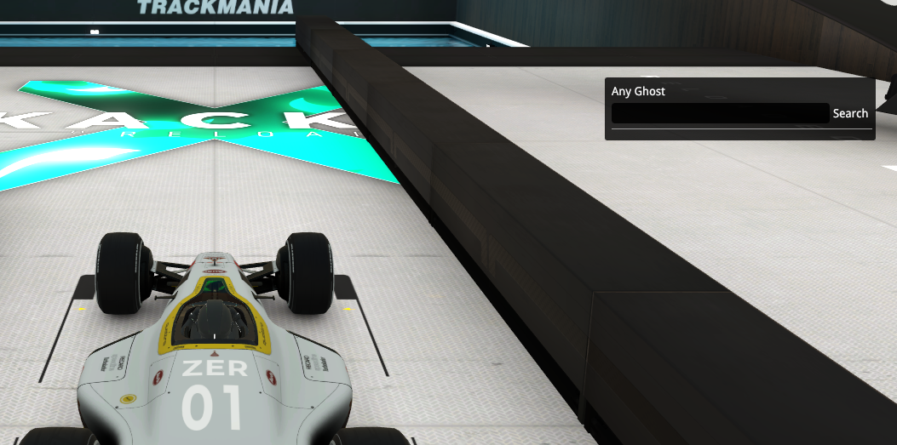
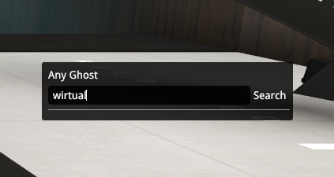
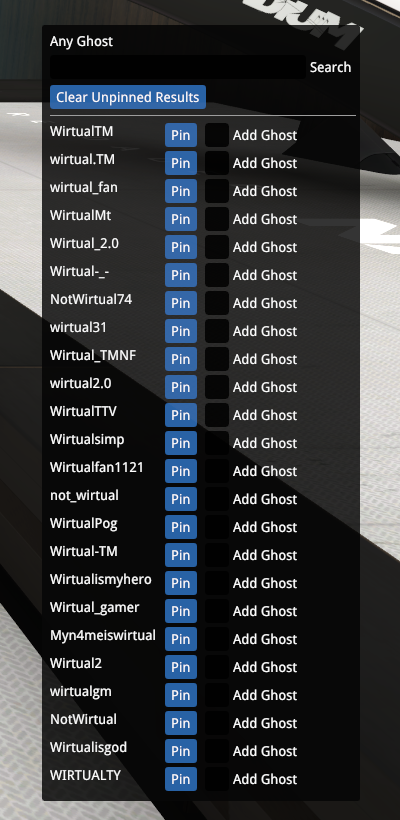
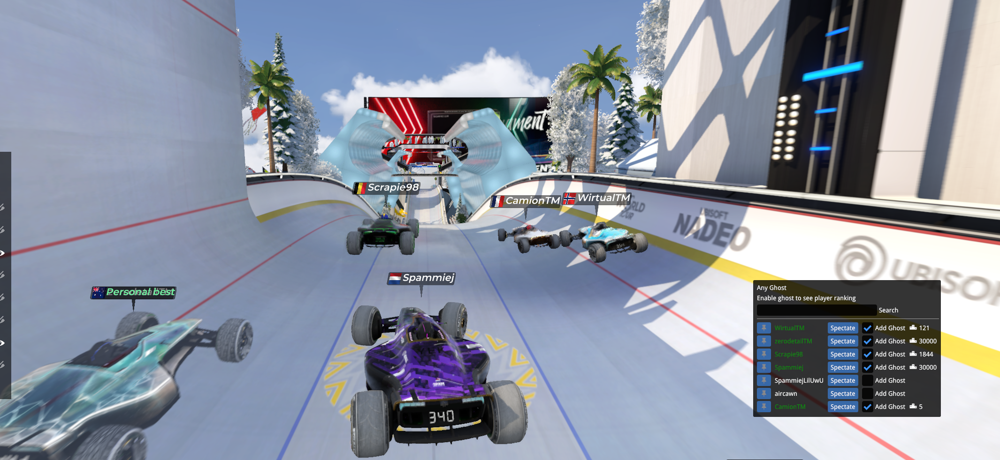

# Any Ghost

This Trackmania 2020 plugin allows you to search for any trackmania user (that exists inside trackmania.io) and quickly enable or disable their ghost to race against.

The default trackmania interface allows users (with club access) to enable ghosts in the top 5 rankings of a given category (world, region, country, etc) as well as players one rank above and one rank below them.
However there is no quick and easy way to add arbitrary user ghosts to race against.

This plugin solves that problem, so you can now quickly enable ghosts for your favourite trackmania streamers, even when they're not good enough to be top 5 world ;)

Feel free to open an issue or submit a pull request if you have one.

# Usage

When installed and enabled, this plugin will automatically open a searchbox UI when you enter a map.

Simply enter a player name, or part of a player name to search for and hit enter. (e.g. to search for wirtual you can just type wirt).

A list of player names who match your search will be returned from Trackmania.io.
Go ahead and click "Pin" to permanently pin that player to your ghosts list.
After that you can click "Clear unpinned results" to remove other irrelevant entries.

You can do this over and over to build a list of ghosts you wish to race against.

Once you have your list, toggle the ghost on and off by clicking the Add ghost radio button.

Good Luck beating those ghosts!

# Version Log

## Version 1.0
Initial Plugin creation
- You can search for any trackmania.io user to add a ghost for
- Found players can be pinned so they dont disappear during future searches
- Click the "add ghost" radio button to toggle that players ghost on/off
